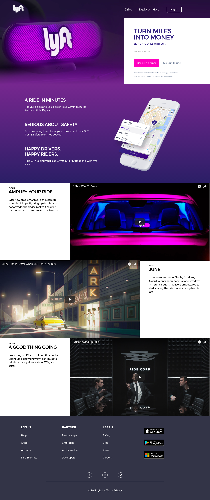

# Lyft

* **Track:** _Common Core_
* **Curso:** _Creando tu primer sitio web interactivo_
* **Unidad:** _Maquetado web con HTML & CSS_

***

## Objetivo

El reto consiste en replicar el sitio de **Lyft**, este será el resultado
a lograr:

* Para el footer, deberás tomar en cuenta que tiene un hover y se ve como en la
  siguiente imagen:

  

  A

